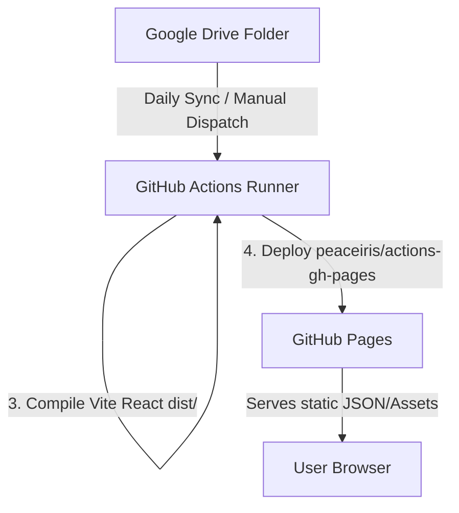

# r/WarRobotsGuide Database & Automated Sync Pipeline

A high-performance, responsive web application for `r/warrobotsguide`, featuring an automated CI/CD pipeline that regularly fetches data from a Google Drive folder and redeploys the site based on the updated spreadsheets and guides.

The frontend is built as a static Single Page Application (SPA) using **React** and **Vite** with custom vanilla CSS glassmorphism, designed to be hosted directly on **GitHub Pages**.

---

## 🛠 Architecture Overview



1. **Google Drive Sync (`scripts/fetch_gdrive.py`)**: Checks for credentials. If present, it authenticates via a Google Service Account, lists the contents of the configured Google Drive folder, downloads `.xlsx` and `.docx` files, and saves them to the `sample data/` folder.
2. **Parser Script (`scripts/parse_data.py`)**: Runs next. It uses `pandas`, `openpyxl`, and `python-docx` to extract text descriptions and cell-style configurations (such as role association color fills) and exports them as normalized JSON files in `src/data/`.
3. **Frontend Bundle**: Vite compiles the React project, bundling the parsed JSON directly into the final client assets (`dist/`). This enables a standalone, zero-database serverless architecture with instant, highly responsive client-side searching and filtering.

---

## 📂 Project Structure

- **`/sample data`**: Directory containing raw spreadsheet and Word files (.xlsx, .docx).
- **`/scripts`**:
  - `fetch_gdrive.py`: Download files from Google Drive using Google API client.
  - `parse_data.py`: Parser to convert raw Excel/Word documents into structured JSON.
- **`/src`**:
  - `/data`: Folder containing generated JSONs (`tiers.json`, `robot_guide.json`, `weapons_dps.json`, `specializations.json`, `pilots.json`).
  - `App.jsx`: Main React application with tab routing, comparison tools, search, and custom SVG charts.
  - `index.css` & `App.css`: High-end custom styling system, featuring dark modes, glowing headers, HSL variables, and interactive animation frames.
- **`index.html`**: Entry point for the Vite project.
- **`.github/workflows/deploy.yml`**: GitHub Actions pipeline for building and deploying to GitHub Pages.

---

## 🚀 Setup & Local Development

### 1. Python Parser Setup (Local)
Create a Python virtual environment and install the required dependencies:
```bash
# Create a venv
python -m venv venv

# Activate and install packages
source venv/bin/activate
pip install pandas openpyxl python-docx google-api-python-client google-auth-httplib2 google-auth-oauthlib
```

### 2. Run Data Parser
Parse raw files to JSON locally:
```bash
./venv/bin/python scripts/parse_data.py
```
This updates the files in `src/data/`.

### 3. Start Frontend Dev Server
Install npm dependencies and launch the dev server:
```bash
# Install node packages
npm install

# Start Vite hot-reload server
npm run dev
```

### 4. Build and Preview Production
```bash
# Compile bundle
npm run build

# Preview local production build
npm run preview
```

---

## 🔗 Automated CI/CD Setup

To enable the automated synchronization from Google Drive:

### 1. Create a Google Service Account
1. Go to the [Google Cloud Console](https://console.cloud.google.com/).
2. Create a project, enable the **Google Drive API**.
3. Create a **Service Account** under IAM & Admin -> Service Accounts.
4. Generate a new key in **JSON format** and download it.
5. Copy the email address of the service account.

### 2. Share the Google Drive Folder
1. Open the Google Drive folder containing your spreadsheets and guides.
2. Click **Share** and grant **Viewer** permissions to the Service Account email.
3. Copy the **Folder ID** from the folder URL: `https://drive.google.com/drive/folders/<FOLDER_ID>`.

### 3. Add GitHub Repository Secrets
Go to your GitHub Repository -> Settings -> Secrets and Variables -> Actions, and add the following secrets:
- **`GDRIVE_FOLDER_ID`**: The Folder ID copied from the Google Drive URL.
- **`GDRIVE_CREDENTIALS_JSON`**: The entire content of the downloaded Service Account JSON key file.

Once added, the GitHub Actions runner will connect to Google Drive, pull the latest guides, parse them, compile, and deploy the new build to GitHub Pages automatically every day at midnight, on push to `master`, or when manually triggered via the **Run workflow** button.
